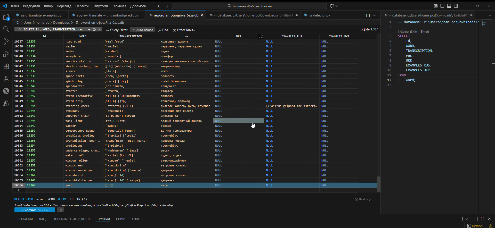
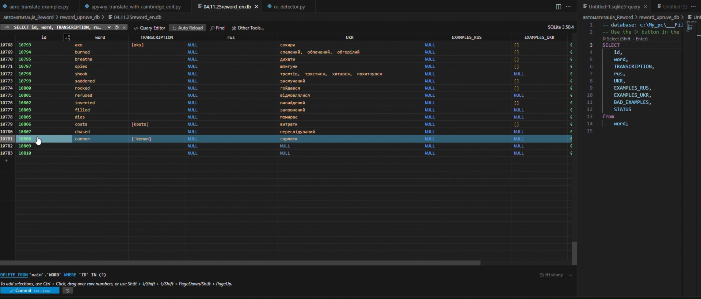

# Reword преміум взлом + повна українізація

> Проєкт створений для того, щоб зробити навчання англійської у **ReWord** зручним для україномовних користувачів.  
> На початковому етапі додаток не мав перекладу на понад **3 000 із 10 000** англійських слів українською.  
> Цей проєкт вирішує проблему шляхом **напів автоматизованого перекладу** та **ручного контролю якості**.

### Більше деталей на фото👆
---
## Як завантажити

1. Перейти у вкладку **Releases**.  
2. Завантажити **останню версію** бази + програма Reword там теж є версії v4.2.8.
[Взлом останньої версії можна знайти тут 4PDA](https://4pda.to/forum/index.php?showtopic=961253&view=findpost&p=131184524)
- Mod by youarefinished
4. Встановити і **імпортувати базу в ReWord** (через налаштування).
   УВАГА, перед відновленням бази СТВОРІТЬ резервну копію свого словника. Хто знає, що може трапитись...  
5. Насолоджуйтесь повністю українським словником у додатку 💙💛  

## Опис проєкту

Скрипт обробляє базу даних ReWord, знаходить англійські слова без українського перекладу, і пропонує кілька варіантів для вибору — з **Cambridge Dictionary**, **EN→UK**, та **RU→UK** перекладів.  
Користувач обирає найкращий варіант, тому переклад виходить точним і природним.
Та сама суть з перекладом прикладів речень. 

### Досягнення:
- Перекладено всі відсутні слова українською (понад 3 000 позицій).  
- Додано переклади прикладів речень (всі що були доступні для москальської аудиторії).
- Додано недоступні тематичні категорії (*«моє хобі»*, *«військова справа»*, *«бізнес»* ...), яких не було в українській версії. 
В офіціала 20 категорій, в покращеному 50.

*До 20 VS 50 після* Ооооо ДА

---

## Демонстрація

**До оновлення:**
> У базі відсутні переклади для понад 3 000 слів.

**Після оновлення:**
> Усі слова мають український переклад та приклади речень.

---

## Як працює скрипт

Скрипт виконує **напівавтоматичний переклад** - він пропонує варіанти перекладу, а користувач вирішує, який залишити.

### Алгоритм:
1. Користувач у скрипті вводить кількість слів (наприклад, '200').
2. Програма бере 200 записів із бази наприклад `reword_en.db`.
3. Для кожного слова:
   - шукає переклад у **Cambridge Dictionary**;
   - якщо немає — пробує **EN→UK** і **RU→UK** через бібліотеку `translators`;
   - створює кілька варіантів перекладу.
4. У терміналі з’являється таблиця:
   - `C` — вибрати Cambridge  
   - `E` — вибрати EN→UK  
   - `R` — вибрати RU→UK  
   - `s` — зберегти  
   - `n` — пропустити  
5. Після завершення збереження формується `reword_import.csv` для перевірки.

---

## Чому напівавтоматичний?

> Скрипт не перекладає все автоматично — він генерує варіанти, але людина вирішує, який переклад правильний.

Переваги:
> Людина контролює якість перекладу.  
> Уникаються машинні помилки.  
> Зберігається природність українських формулювань.

---

## Результат

> ✅ Оновлена база SQLite із заповненим полем `UKR`.  
> ✅ Повноцінна українізація словникової бази ReWord.  

---

## Як завантажити

1. Відкрити вкладку **Releases**.
2. Завантажити останню версію (`reword_ukrainian_v1.0.zip`).
3. Розпакувати й імпортувати базу в ReWord.

> !!! *Проєкт демонструє роботу зі словниковими даними. Автор не розповсюджує офіційні файли ReWord.*

---

## Технічні деталі

| Компонент | Опис |
|------------|------|
| **Мова** | Python 3 |
| **Бібліотеки** | `requests`, `beautifulsoup4`, `translators`, `sqlite3`, `re`, `json` |
| **Джерело перекладів** | Cambridge Dictionary + MyMemory + Bing |
| **Формат бази** | SQLite (.db) |
| **Режим** | Напівавтоматичний — користувач затверджує переклад |

---

## План оновлень

- [ ] Додавання нових категорій за темами 
- [ ] Розширення словника новими словами й прикладами.  
- [ ] Підтримка актуальної версії бази під майбутні оновлення ReWord.

---
Якщо тобі сподобався проєкт — не забудь поставити **Star** і поділитися з іншими українськими користувачами ReWord!
Рік створення: 2025 
